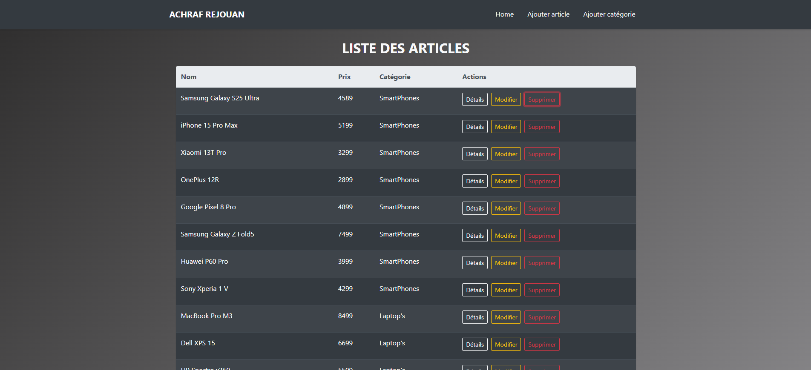
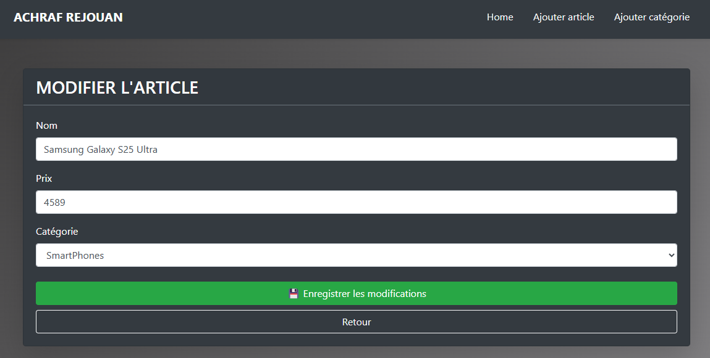
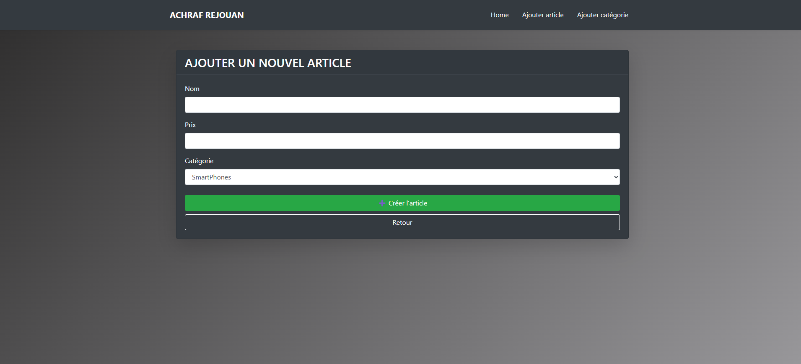
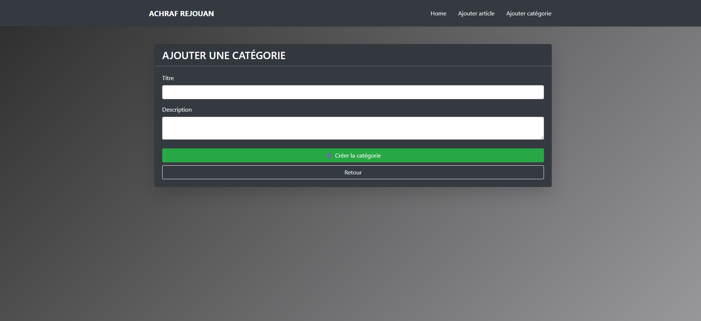
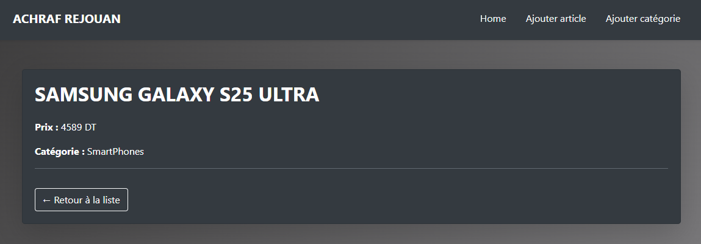

# Symfony 7 Project Setup

This guide will help you set up and run this Symfony 7 project on your local machine.

---

## 🧰 Requirements

Make sure you have the following installed:

- PHP >= 8.2
- [Composer](https://getcomposer.org/)
- [Symfony CLI (optional but recommended)](https://symfony.com/download)
- MySQL (or another DB, depending on your project)

---

## 🚀 Installation Steps

### 1. Clone the repository

```bash
git clone https://github.com/your-username/your-repo-name.git
cd your-repo-name
```

### 2. Install PHP dependencies

```bash
composer install
```

### 3. Set up the database

```bash
php bin/console doctrine:database:create
php bin/console doctrine:migrations:migrate
```

### 4. Run the Symfony server

Using Symfony CLI:

```bash
symfony server:start
```

Or with PHP built-in server:

```bash
php -S localhost:8000 -t public
```

---

## 🖼️ Screenshots

### 🧭 Routes


### ✏️ Edit Article


### ➕ Add Article


### 📂 Add Category


### 🔍 Article Details
